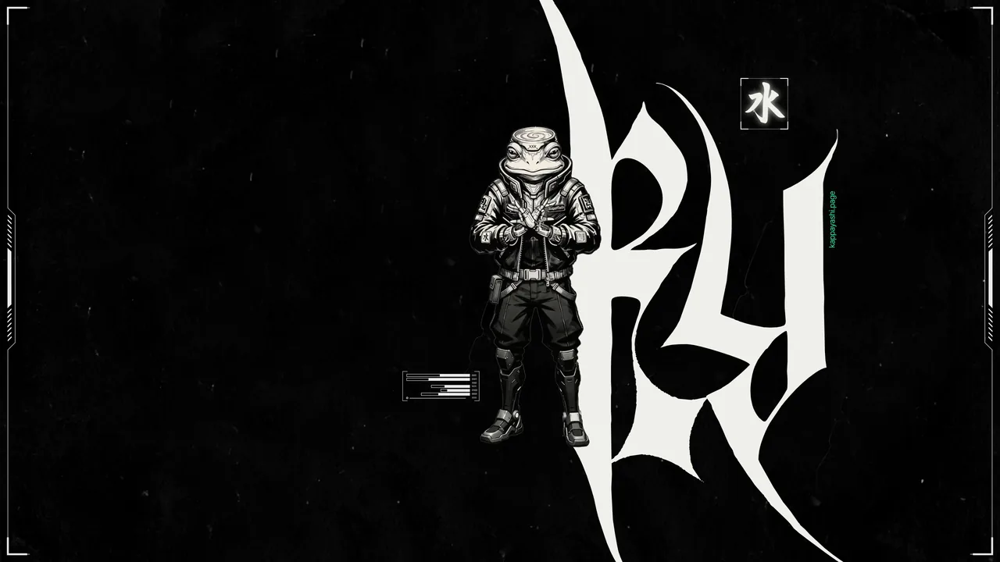
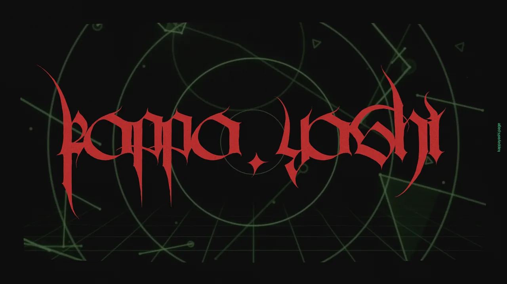
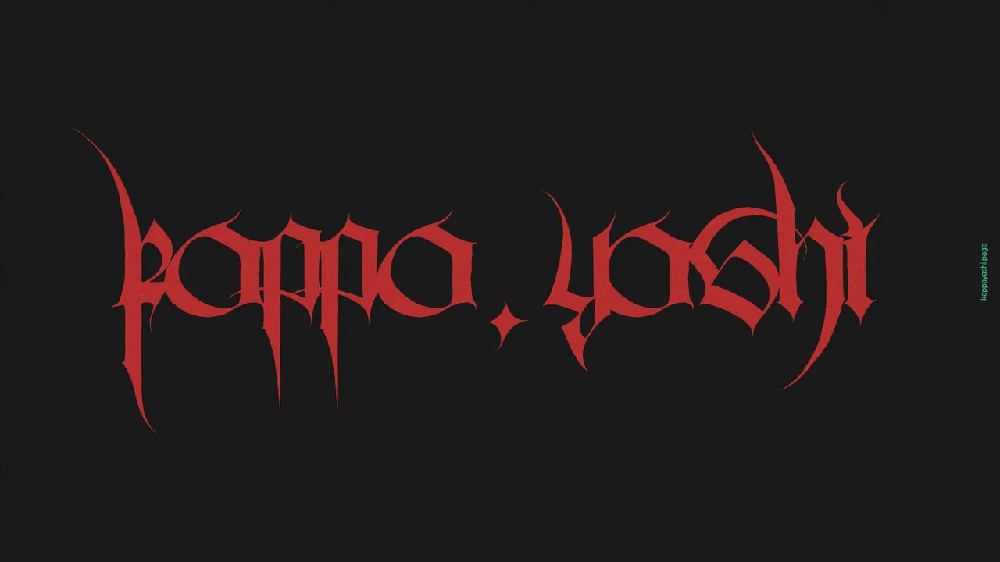
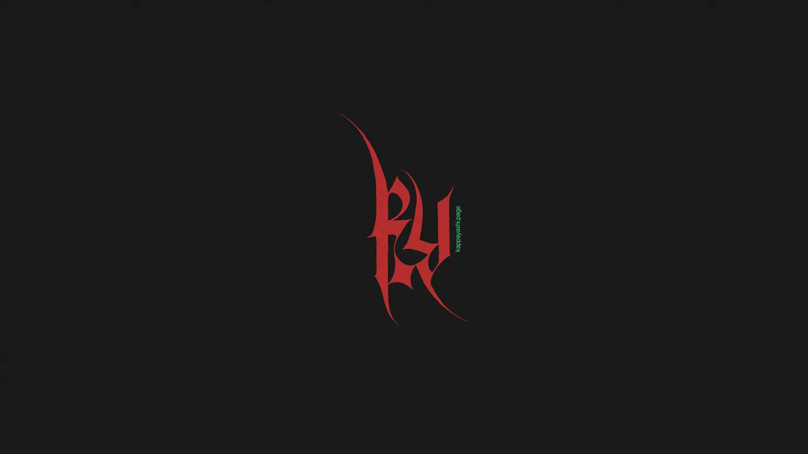

# kappa.yashi wallpapers

Official desktop wallpapers from [kappa.yashi](https://www.kappayashi.page): gothic-cyberpunk art, free to download.

Every collection ships as **one zip** with all wallpapers in three resolutions:

| folder | resolution  |
|--------|-------------|
| `4k`   | 3840 × 2160 |
| `2k`   | 2560 × 1440 |
| `hd`   | 1920 × 1080 |

## Download

**[→ Latest collection](https://github.com/kappa-yashi/wallpapers/releases/latest)** (about 40 MB)

Older collections live on the [Releases](https://github.com/kappa-yashi/wallpapers/releases) page, one release per drop.

## Collection 2026-10 · brand walls

Five wallpapers, 16:9, each in 4K, 2K and HD.

<table>
  <tr>
    <td colspan="2"> <b>creature-01</b> · the kappa in the hood</td>
  </tr>
  <tr>
    <td width="50%"> <b>creature-02</b> · full figure, KY mark</td>
    <td width="50%"> <b>80s</b> · wordmark over a radar grid</td>
  </tr>
  <tr>
    <td width="50%"> <b>wordmark</b> · red on charcoal</td>
    <td width="50%"> <b>logomark</b> · the KY mark, minimal</td>
  </tr>
</table>

## Install

**Linux Mint (Cinnamon):** unzip anywhere (e.g. `~/Pictures`), right-click the desktop → *Change Desktop Background* → `+` → pick the folder.

**Anything else:** unzip and set any image from the folder as your wallpaper.

## License

[CC BY-NC 4.0](LICENSE): free to share and adapt with credit to "kappa.yashi", not for commercial use.

---

[kappayashi.page](https://www.kappayashi.page) · [lab page](https://www.kappayashi.page/lab/wallpapers/)
